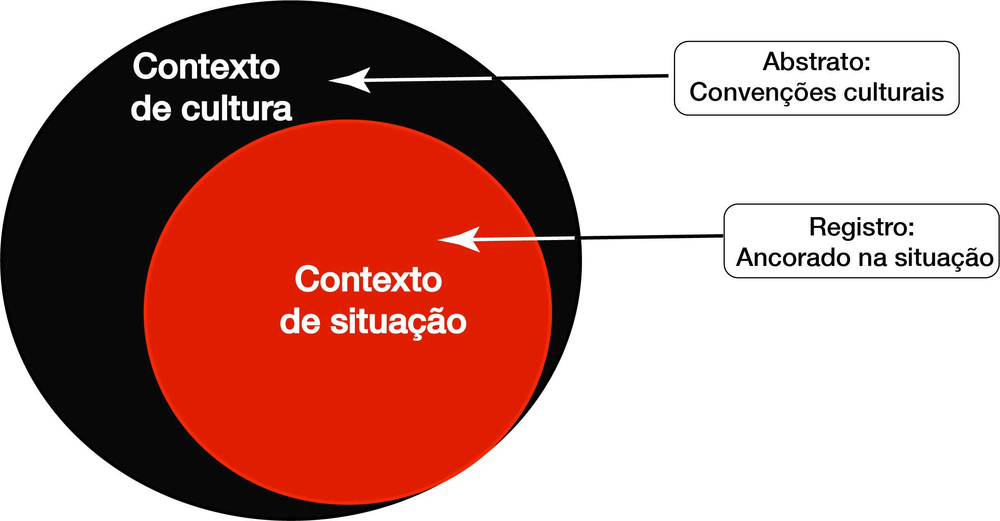
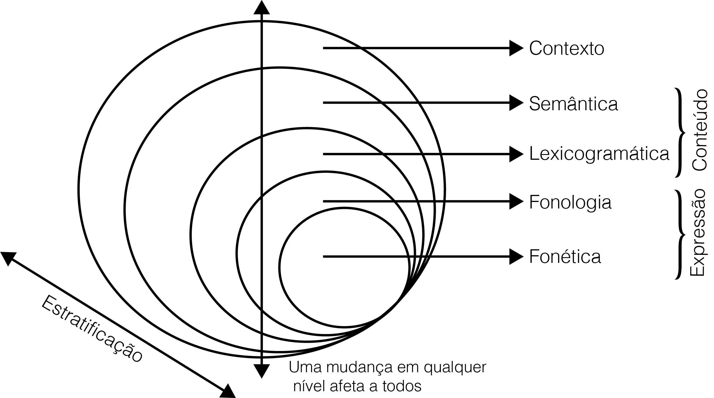
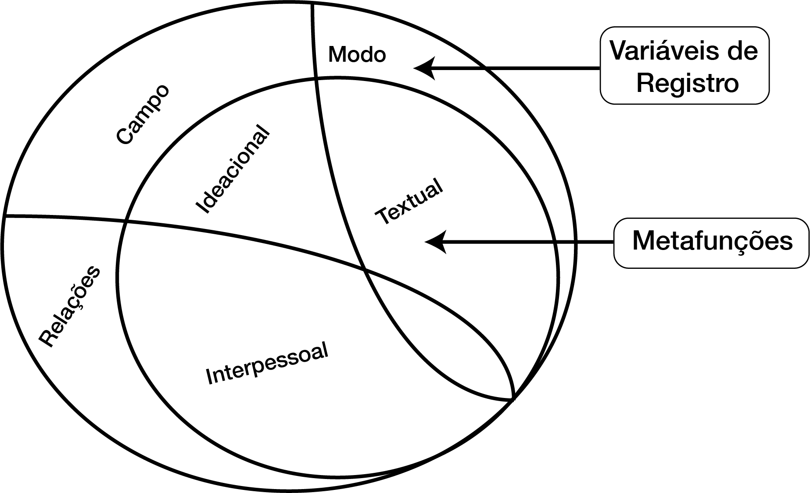
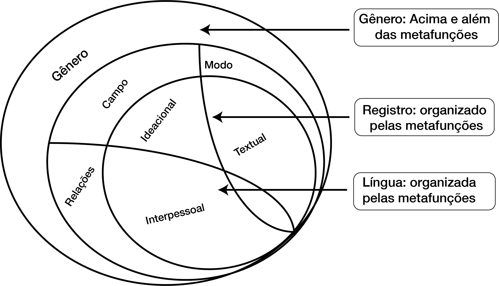
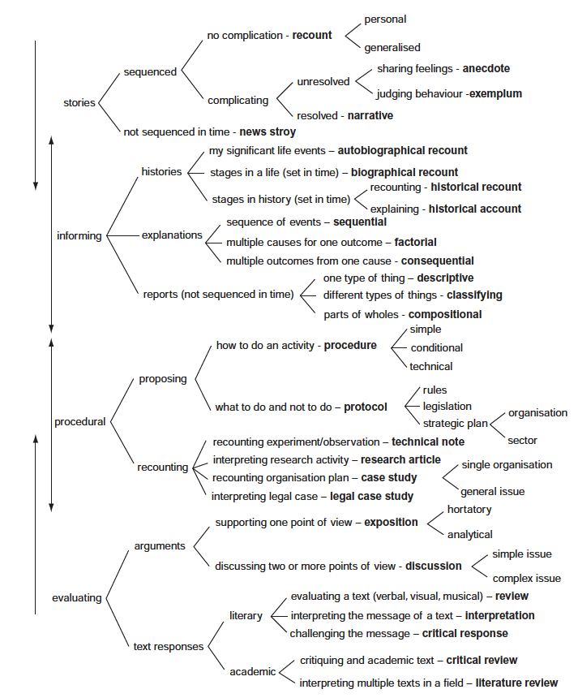
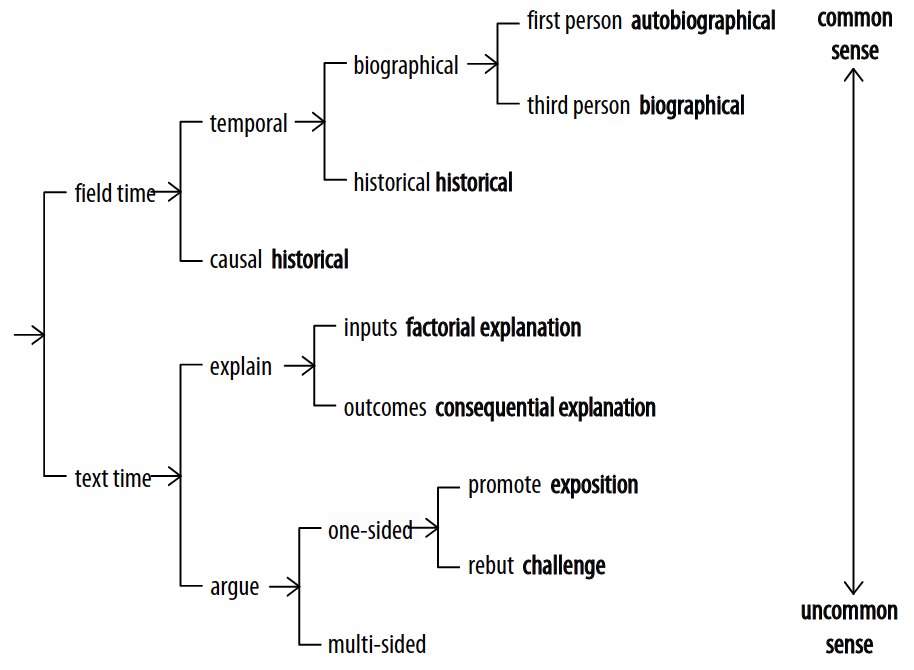
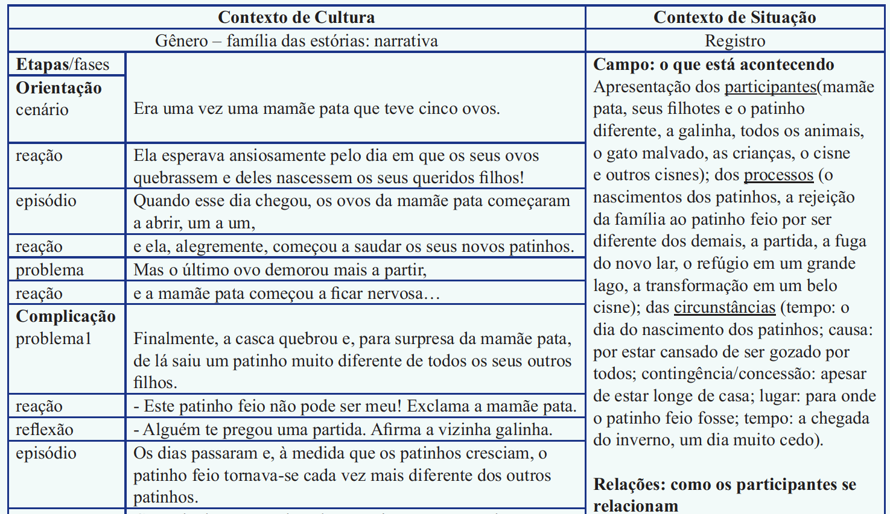
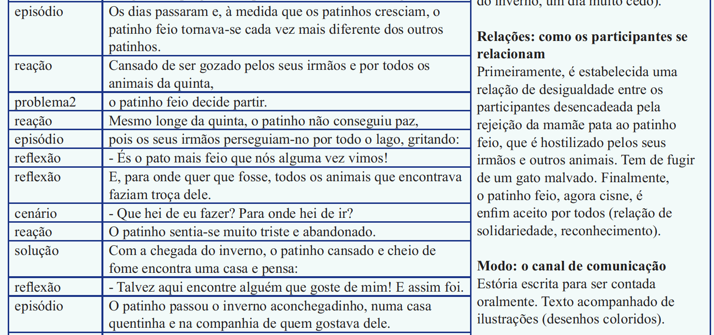
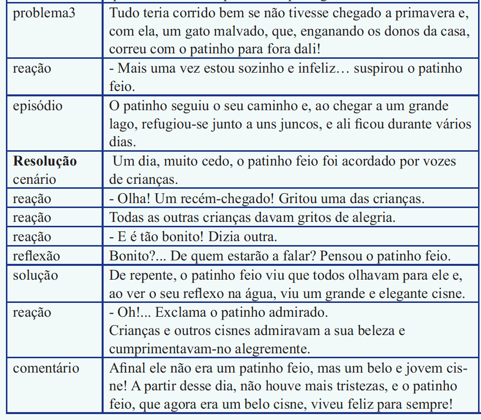

class: middle, animated, fadeIn

```{r setup, include=FALSE}
 options(htmltools.dir.version = FALSE)
```

<style>
.center2 {
  margin: 0;
  position: absolute;
  top: 50%;
  left: 50%;
  -ms-transform: translate(-50%, -50%);
  transform: translate(-50%, -50%);
}
</style>
<style>
.pre2 {
    display: block;
    font-family: monospace;
    white-space: pre;
    margin: 3em 0px;
    margin-top: 0em;
    margin-right: 0px;
    margin-bottom: 0em;
    margin-left: 0px;
}
</style>

<style>
.font80 {
  font-size: 80%;
}
</style>

# Aquilo que pretendemos
.big[
* .RUred[Refletir] de forma *introdutória* sobre a teoria dos Gêneros no âmbito da Linguística Sistêmico-Funcional (LSF)
* .RUred[Origens]: quais modelos teóricos *influenciaram* a criação da teoria
* .RUred[Objetivos práticos]: a que *serve* a teoria dos gêneros desenvolvida no âmbito da LSF
* .RUred[Obras comentadas]: algumas obras comentadas para que possamos conhecer melhor à teoria
]

???
- Agradecer a Solange pelo convite
- Agradecer aos colegas por assistirem o trabalho
---
class: animated, fadeIn, middle

# Formação e influências principais

- .RUred[Firth] (Linguística):
    - Influência do contexto nas escolhas: *One might know a word by the company it keeps* (Firth, 1956)
- .RUred[Malinowski] (Antropologia):
    - Níveis de contexto 
        - Contexto de cultura
        - Contexto de situação
    - Relação entre linguagem e contexto: a linguagem é/reflete o contexto
- .RUred[Bernstein] (Sociologia):
    - Língua e suas relações sociais
        - A língua reflete as formas e os pressupostos dos grupos sociais aos quais nos relacionamos
        - É possível codificar os processos de realização da linguagem
- .RUred[Hjelmslev] (Linguística):
    - A língua é uma semiose denotativa do contexto social, sendo este uma semiose conotativa realizada por meio da língua
---

class: animated, fadeIn, middle

# Formação e influências principais
.big[
- .RUred[Bloonfiled] (Linguística):
 - Deslocamento dos processos de escolha para o eixo paradigmático
- .RUred[Jakobson e Martinet] (Linguística):
 - Funções de Linguagem
 - Tema/Rema
- .RUred[Austin] (Filosofia):
 - Atos de fala
 - Performatividade da linguagem
]

---
class:  middle, animated, fadeIn

# Algumas consequências…


1. .RUred[Quebras] de dicotomias Saussurianas
   - Arbitrariedade do signo
   - Dupla articulação (forma e significado não se diferenciam)
2. Importância do .RUred[fazedor de signos]
   - O indivíduo responsável pela construção do significado tem importante papel
   - A ele é conferido o poder de criar significados adequados às situações de comunicação
3. .RUred[Inter-relação] entre os níveis
   - O contexto é modificado pela linguagem que também a modifica

---
class: animated, fadeIn, middle

## O papel da Linguística

- Halliday (2004) cunha o termo **Linguística Aplicável**:
  - A linguística como .RUred[ciência social aplicada] (Stubbs, 1994; Hasan, 2014)
- A linguística hallidiana é **social** e **não** *cognitiva* (Rose, 2015)
  - O significado é .RUred[motivado] pelas necessidades comunicacionais e discursivas (Halliday, 1978)
    - **Não arbitrariedade**  do signo (Kress, 1993; Martin, 2016).
- A .RUred[escolha] é um conceito determinante na abordagem:
  - Ao escolhermos um significado:
     - Expressamos nossa **relação** com os demais indivíduos
     - **Representamos** o mundo em termos de significados
     - **Organizamos** a mensagem de forma socialmente reconhecida

.grey[Notas importantes]:
- Nem toda a escolha e sua motivação são conscientes
- Discurso poderia ser definido como **conhecimento** (Kress e Van Leeuwen, 2001)
- Toda escolha ocorre em detrimento de outra escolha (Thompson, 2004)

---
class:  middle, animated, fadeIn

# Contexto/metafunção/sistemas

```{r fig2 ,echo=FALSE,fig.align='center',fig.cap="Contexto de cultura e situação (Halliday,1975)"}

```

---
class:  middle, animated, fadeIn, center
# Uma gramática em níveis

```{r fig1 ,echo=FALSE,fig.align='center',fig.cap="Níveis em LSF, traduzido de Halliday (1994)"}

```

---
class:  animated, fadeIn

# Instanciação da linguagem

.center2[
```{r, include=TRUE, echo=FALSE, message=FALSE, warning=FALSE, fig.pos="h!", out.height="120%", fig.align="center", fig.cap="A instanciação"}

library(DiagrammeR)
grViz("digraph flowchart {
      # node definitions with substituted label text
      node [fontname = Helvetica, shape = rectangle]
      A [label = 'Contexto de cultura', fontsize = 20, fontcolor= black]
      B [label = 'Contexto de situação', fontsize = 20, fontcolor= black]
      C [label = 'Variáveis de Registro',fontsize = 20, fontcolor= black]
      D [label = 'Metafunções',fontsize = 20, fontcolor= black]
      E [label = 'Realização',fontsize = 20, fontcolor= black]
      F [label = 'Texto',fontsize = 20, fontcolor= black]
      G [label = 'Instanciação',fontsize = 20, fontcolor= black]
      A->B;
      {rank=same; B->C[dir=none]};
      C->D;
      {rank=same; D->E[dir=none]};
      D->F;
      {rank=same; F->G[dir=none]};
}
")
```
]

---

class:  middle, animated, fadeIn

# Relação entre registro e metafunções

```{r, include=TRUE, echo=FALSE, message=FALSE, warning=FALSE}
library(knitr)
library(kableExtra)
registro <- c("Campo","Modo","Relações")
metafuncoes <-c("Ideacional", "Textual","Interpessoal")
f.registro <-c("Do que se fala", "O papel da linguagem","Quem está participando e suas relações")
f.metafuncoes <- c("Construção da experiência","Organização do texto", "Recursos para interação")
sistemas <-c('Transitividade',"Tema/Rema",'Modo')
table<-data.frame(registro,f.registro,metafuncoes,f.metafuncoes,sistemas)
colnames(table)<-c("Variáveis de Registro","Significado", "Metafunção","Significado",'Sistema')
kable(table,caption = "Registro e Metafunções")%>%
  kable_styling(bootstrap_options = c('bordered', "hover"),font_size = 18)
```

### Nota:
Apesar da repetição de nome o Modo (registro) e o Modo (sistema), elas não significam a mesma coisa. O primeiro viria do inglês *Mode* ao paso que o segundo do inglês *Mood*. 
---

class:  middle, animated, fadeIn

# Relação entre  registro e as metafunções


```{r fig3 ,echo=FALSE,fig.align='center',fig.cap="Relação entre  registro e as metefunções"}

```


---

class:  middle, animated, fadeIn


# Lugar do gênero na LSF

Hasan (Halliday e .RUred[Hasan], 1991)
- Relacionamento da teoria Hallidiana à noção de gênero
  - Contexto de cultura --> Gênero

.RUred[Martin] (1992)
- Gênero como evento social 

Martins & Eggins (1997)
- Relação entre as teorias de gênero e registro (G&RT)

.RUred[Eggins] (1997)
- Análise de linguagem casual e cotidiana

---

class:  middle, animated, fadeIn

# Relação entre gênero e registro


```{r fig4 ,echo=FALSE,fig.align='center',fig.cap="O gênero em relação ao registro e à Língua (Traduzido de: Eggins & Martin,1997: 243)"}

```


---

class:  middle, animated, fadeIn

# A escola de Sidney
## Definição de gênero

> (…) as staged, .RUred[goal oriented social processes]: social since texts are always **interactive events**; goal oriented in that a text unfolds towards its interactants’ **purposes**; staged, because it usually takes **more than one step** to reach the goal. In functional linguistics terms this means that genres are defined as a **recurrent configuration** of .RUred[meanings], which enact the .RUred[social practices of a culture] (Rose, 2015, p. 209 - *Grifos meus*).


---
class:  animated, fadeIn

## A abordagem

- Foco na redistribuição de recursos semióticos por meio da educação ao invés da mera crítica ao poder
    - A abordagem é claravente **intervencionista** (projetos)
      - Inclusão de imigrantes e populações nativas (EFL/ESL)
      - **Currículo** no ensino Australiano
- O gênero poderia se caracteriza pela presença, ausência ou recorrência de estágios e padrões linguísticos de instanciação 
    - A descrição do gênero ocorre por meio de uma observação **empírica** da linguagem em uso. 
- Mapeamento de **gêneros** .RUred[implicaria] no mapeamento de uma **cultura**. 
- Gêneros podem estar **inter-relacionados** por um série de características
    - Propósito comunicativo
    - Foco nas entidades ou atividades
    - Participante individual vs. genérico
    <br/><br/>
.font80[
.pull-right[(Martin & Rose 2008; Rose, 2015; Rose & Martin, 2012)]
]

---
class:  animated, fadeIn

```{r fig5 ,echo=FALSE,fig.align='center',out.width="65%", fig.cap="Gêneros Educacionais (Rose, 2015: 212)"}

```

---

class:  middle, animated, fadeIn

```{r fig6 ,echo=FALSE,fig.align='center',out.width="85%", fig.cap="Gêneros Narrativos (Martin & Rose, 2008: 130)"}

```


---

class:  middle, animated, fadeIn

```{r fig7 ,echo=FALSE,fig.align='center',out.width="115%", fig.cap="Análise de um exemplar da família das 'estórias' (Silva, 2018: 323-324) - Parte 1"}

```


---

class:  middle, animated, fadeIn

```{r fig8 ,echo=FALSE,fig.align='center',out.width="130%", fig.cap="Análise de um exemplar da família das 'estórias' (Silva, 2018: 323-324) - Parte 2"}

```


---

class:  middle, animated, fadeIn

```{r fig9 ,echo=FALSE,fig.align='center',out.width="85%", fig.cap="Análise de um exemplar da família das 'estórias' (Silva, 2018: 323-324) - Parte 3"}

```


---

class:  middle, animated, fadeIn

.center2[
```{r, include=TRUE, echo=FALSE, message=FALSE, out.width="120%", warning=FALSE, fig.align="center",fig.cap="Visualização topológica das fases, baseado em Silva (2018)"}

library(DiagrammeR)
DiagrammeR::grViz("
  digraph {
      # node definitions with substituted label text
      node [fontname = 'Helvetica-bold', shape = rectangle]
      
      # Nodes fase 1
      FASE_1 [label = 'Orientação', fontsize = 34, fontcolor= black]
      FASE_1_1 [label = 'Cenário', fontsize = 23,style = filled, fillcolor=gray37,fontcolor=white]
      FASE_1_2 [label = 'Reação', fontsize = 23, fontcolor= black,style = filled, fillcolor=yellowgreen]
      FASE_1_3 [label = 'Episódio', fontsize = 23, fontcolor= white,style = filled, fillcolor=gold3]
      FASE_1_4 [label = 'Reação', fontsize = 23, fontcolor= black,style = filled, fillcolor=yellowgreen]      
      FASE_1_5 [label = 'Problema', fontsize = 23, style = filled, fillcolor=red4,fontcolor=white]
      FASE_1_6 [label = 'Reação', fontsize = 23, fontcolor= black,style = filled, fillcolor=yellowgreen]
      
      # Nodes fase 2
      FASE_2 [label = 'Complicação', fontsize = 34, fontcolor= black]
      #Fase 2.1
      FASE_2_1_1 [label = 'Problema', fontsize = 23, style = filled, fillcolor=red4,fontcolor=white]
      FASE_2_1_2 [label = 'Reação', fontsize = 23, fontcolor= black,style = filled, fillcolor=yellowgreen]
      FASE_2_1_3 [label = 'Reflexão', fontsize = 23, fontcolor= white,style = filled, fillcolor=dodgerblue4]
      FASE_2_1_4 [label = 'Episódio', fontsize = 23, fontcolor= white,style = filled, fillcolor=gold3]
      FASE_2_1_5 [label = 'Reação', fontsize = 23, fontcolor= black,style = filled, fillcolor=yellowgreen]
      
      #Fase 2.2
      FASE_2_2_1 [label = 'Problema', fontsize = 23, style = filled, fillcolor=red4,fontcolor=white]
      FASE_2_2_2 [label = 'Reação', fontsize = 23, fontcolor= black,style = filled, fillcolor=yellowgreen]
      FASE_2_2_3 [label = 'Episódio', fontsize = 23, fontcolor= white,style = filled, fillcolor=gold3]
      FASE_2_2_4 [label = 'Reflexão', fontsize = 23, fontcolor= white,style = filled, fillcolor=dodgerblue4]
      FASE_2_2_5 [label = 'Reflexão', fontsize = 23, fontcolor= white,style = filled, fillcolor=dodgerblue4]
      FASE_2_2_6 [label = 'Cenário', fontsize = 23,style = filled, fillcolor=gray37,fontcolor=white]      
      FASE_2_2_7 [label = 'Reação', fontsize = 23, fontcolor= black,style = filled, fillcolor=yellowgreen]
      FASE_2_2_8 [label = 'Solução', fontsize = 23, fontcolor= white,style = filled, fillcolor=purple2]
      FASE_2_2_9 [label = 'Reflexão', fontsize = 23, fontcolor= white,style = filled, fillcolor=dodgerblue4]
      FASE_2_2_10 [label = 'Episódio', fontsize = 23, fontcolor= white,style = filled, fillcolor=gold3]

      #Fase 2.3
      FASE_2_3_1 [label = 'Problema', fontsize = 23, style = filled, fillcolor=red4,fontcolor=white]
      FASE_2_3_2 [label = 'Reação', fontsize = 23, fontcolor= black,style = filled, fillcolor=yellowgreen]
      FASE_2_3_3 [label = 'Episódio', fontsize = 23, fontcolor= white,style = filled, fillcolor=gold3]
      
      #Nodes fase 3
      FASE_3[label = 'Resolução', fontsize = 34, fontcolor= black]
      FASE_3_1 [label = 'Cenário', fontsize = 23,style = filled, fillcolor =gray37,fontcolor=white]
      FASE_3_2 [label = 'Reação', fontsize = 23, fontcolor= black,style = filled, fillcolor=yellowgreen]
      FASE_3_3 [label = 'Reação', fontsize = 23, fontcolor= black,style = filled, fillcolor=yellowgreen]
      FASE_3_4 [label = 'Reação', fontsize = 23, fontcolor= black,style = filled, fillcolor=yellowgreen]  
      FASE_3_5 [label = 'Reflexão', fontsize = 23, fontcolor= white,style = filled, fillcolor=dodgerblue4]
      FASE_3_6 [label = 'Solução', fontsize = 23, fontcolor= white,style = filled, fillcolor=purple2]
      FASE_3_7 [label = 'Reação', fontsize = 23, fontcolor= black,style = filled, fillcolor=yellowgreen]
      FASE_3_8 [label = 'Comentário', fontsize = 23, fontcolor= white, style = filled, fillcolor=orange] 
      
      subgraph cluster_0 {
        color=blue;
        style=dashed;
        penwidth= 2.5;
        FASE_1->FASE_1_1;
        FASE_1_1->FASE_1_2;
        FASE_1_2->FASE_1_3;
        FASE_1_3->FASE_1_4;
        FASE_1_4->FASE_1_5;
        FASE_1_5->FASE_1_6;
      }
      subgraph cluster_1 {
        color=coral;
        style=dashed;
        penwidth= 2.5;
        FASE_2->FASE_2_1_1;
        FASE_2_1_1->FASE_2_1_2;
        FASE_2_1_2->FASE_2_1_3;
        FASE_2_1_3->FASE_2_1_4;
        FASE_2_1_4->FASE_2_1_5;

      }   
        subgraph cluster_2 {
        color=coral;
        style=dashed;
        penwidth= 2.5;
        FASE_2->FASE_2_2_1;
        FASE_2_2_1->FASE_2_2_2;
        FASE_2_2_2->FASE_2_2_3;
        FASE_2_2_3->FASE_2_2_4;
        FASE_2_2_4->FASE_2_2_5;
        FASE_2_2_5->FASE_2_2_6;
        FASE_2_2_6->FASE_2_2_7;
        FASE_2_2_7->FASE_2_2_8;
        FASE_2_2_8->FASE_2_2_9;
        FASE_2_2_9->FASE_2_2_10;

        }
      subgraph cluster_3 {
        color=coral;
        style=dashed;
        penwidth= 2.5;
        FASE_2->FASE_2_3_1;
        FASE_2_3_1->FASE_2_3_2;
        FASE_2_3_2->FASE_2_3_3;
      }
      
      subgraph cluster_4 {
        color=deeppink4;
        style=dashed;
        penwidth= 2.5;
        FASE_3->FASE_3_1;
        FASE_3_1->FASE_3_2;
        FASE_3_2->FASE_3_3;
        FASE_3_3->FASE_3_4;
        FASE_3_4->FASE_3_5;      
        FASE_3_5->FASE_3_6;
        FASE_3_6->FASE_3_7;
        FASE_3_7->FASE_3_8;
      }
      
      
      #Interphase
      {rank=same; FASE_1->FASE_2};
      {rank=same; FASE_2->FASE_3};
     
}
")
```
]

---
class:  middle, animated, fadeIn

```{r, include=TRUE, echo=FALSE, message=FALSE, warning=FALSE}
library(knitr)
library(kableExtra)
Fases<-c("Cenário", "Reação",'Episódio', "Problema", "Reflexão", 'Solução', 'Comentário')
Exemplos<-c('Era uma vez uma mamãe (…)', 
            'Cansado de ser gozado (…)',
            'O patinho seguiu o seu caminho e (…)', 
            'Tudo teria corrido bem se não tivesse chegado (…)',
            'De quem estarão a falar? Pensou o patinho feio',
            'De repente, o patinho feio viu que todos olhavam para ele (…)',
            'Afinal ele não era um patinho feio (…)')
Significado<-c("Pano de fundo da ação",
               "Elemento atitudinal",
               "Manutenção do fluxo",
               "Realimentação da ação",
               "Hipótese de solução",
               "Minimização de conflitos",
               "Avaliação moral")
Padroes<-c("Elemento circunstancial/Processos existenciais",
           "Processos mentais/Epítetos",
           'Processos materiais',
           'Elementos modais, processos materiais',
           'Processos mentais',
           'Elementos circunstanciais, processos comportamentais',
           'Elementos circunstanciais, processos relacionais')

table<-data.frame(Fases,Exemplos,Significado,Padroes)
colnames(table)<-c("Fases","Exemplos", "Significado","Padrões")
kable(table,caption = "Alguns padrões")%>%
  kable_styling(bootstrap_options = c('bordered', "hover",'condensed'),font_size = 15)
```


---

class:  middle, animated, fadeIn

# Algumas obras essenciais
## Para iniciarmos no mundo do gênero na LSF

.font80[
1. Halliday, M.A.K. 1978. *Language as social semiotic: the social interpretation of language and meaning*. London: University Park Press
  - Traz a primeira sistematização *madura* do modelo
1. Halliday, M.A.K., & Ruqaiya Hasan. 1991. *Language, context and text: aspects of language in a social-semiotic perspective*. Oxford: Oxford University Press.
  - Obra na qual Hasan realiza conexão entre a ideia de gênero e contexto de cultura
1. Halliday, M.A.K. 1984/1994/2004/2014. *An Introduction to Functional Grammar*. London: Arnold
  - Obra que traz a sistematização das metafunções e seu papel discursivo/gramatical
1. Martin, J. R. 1992. *English Text: System and Structure*. Philadelphia: Benjamins
  - Obra traz importantes reflexões sobre a construção do texto em LSF
]


---

class:  middle, animated, fadeIn

1. Eggins, Suzanne, & J.R. Martin. 1997. “Genres and Registers of Discourse”. In Discourse as Structure and Process: Discourse Studies: A Multidisciplinary Introduction, organizado por Teun A. van Dijk, 230–56. London: SAGE Publications.
  - Traz uma importante relação entre as teorias de gênero e registro
1. Martin, J. R., e David Rose. 2008. *Genre relations: mapping culture*. Equinox textbooks and surveys in linguistics. London/Oakville, CT: Equinox Pub.
  - Mapeamento de gêneros como processo cultural
1. Martin, J. R., e David Rose. 2012. Learning to Write, Reading to Learn: Genre, Knowledge and Pedagogy in the Sydney School. Bristol, CT; South Yorkshire: Equinox Publishing Limited.
  - Reflete sobre a experiência da 'Escola de Sidney', compartilhando seu modelo pedagógico de forma sistemática
1. Thompson, Geoff. 2004. *Introducing functional grammar*. London/New York: Arnold/Oxford University Press.
  - Importante obra de introdução à teoria.


---
class: inverse, animated, fadeIn, middle

## Financiamento
```{r fig12 ,echo=FALSE,fig.align='center',out.width = "200px"}
knitr::include_graphics('./images/cnpq.png')
```

## Obrigado! 

.RUred[Rodrigo Esteves de Lima-Lopes]


[rll307@unicamp.br](mailto:rll307@unicamp.br)


[http://www.iel.unicamp.br/rll307](http://www.iel.unicamp.br/rll307)

[https://github.com/rll307/keynote_2020_2](https://github.com/rll307/keynote_2020_2)


```{r fig10 ,echo=FALSE,fig.align='center', out.width = "200px"}
knitr::include_graphics('./images/negativo.png')
```


